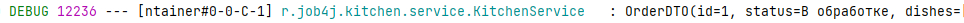

# Микросервисный проект - Доставка еды "Голодный волк".

## Общее описание:

Заказ блюд на дом. Блок кухня.
* [Блок заказов](https://github.com/PerpetuumEbner/job4j_order)
* [Блок блюда](https://github.com/PerpetuumEbner/job4j_dish)
* [Блок уведомления](https://github.com/PerpetuumEbner/job4j_notification)

***

## Реализовано:

* Принятие заказа
* Приготовление блюда
* Изменение статуса заказа

***

## Технологии:

***

## Запуск проекта:

* создать базу данных `kitchen`
* `maven install`
* `java -jar target/kitchen-0.0.1-SNAPSHOT.jar`

***

## Структура проекта:

### Принятие заказа
Кухня принимает заказ через брокер сообщений.

### Приготовление блюда
Кухня может приготовить блюдо, до тех пор, пока есть для него продукты. Для каждого блюда существуют свои ингредиенты,
их количество уменьшается. Если ингредиенты закончились, то блюдо не может быт приготовлено.

### Изменение статуса заказа
После приготовления статус заказа меняется на "Собран" через брокер сообщений. Если блюдо не может быть приготовлено,
то статус меняется на "Отменён".